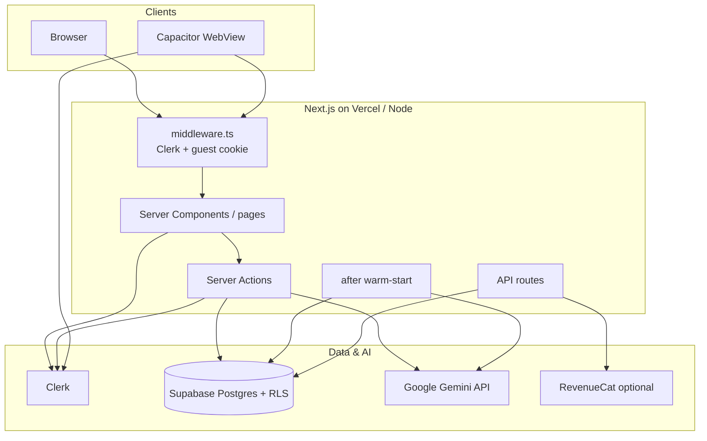
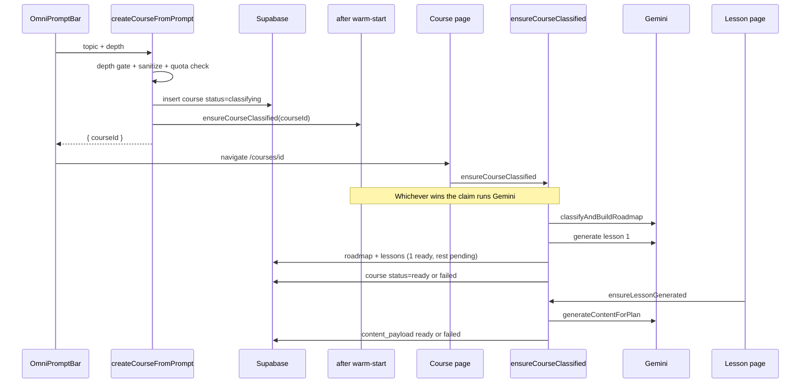

# Gal-zu — Developer Documentation

**Gal-zu** is an AI-powered adaptive learning platform. Learners type what they want to learn; the app classifies a course roadmap, generates interactive lessons (slideshows, quizzes, scripts, cheat sheets), and personalizes content from declared preferences plus observed usage — without silently substituting fake “success” content when generation fails.

This document is the developer-facing map of the system: stack, architecture, how pieces talk, generation, personalization, freemium, mobile, and the invariants you must not undo.

Living companion: [`AGENTS.md`](../AGENTS.md) (agent workflow + standing quality rules). Prefer keeping **architecture truth** in sync between this file and the Project State section of `AGENTS.md`.

---

## Table of contents

1. [Product overview](#1-product-overview)
2. [Technology stack](#2-technology-stack)
3. [Repository layout](#3-repository-layout)
4. [Runtime architecture](#4-runtime-architecture)
5. [Authentication & identity](#5-authentication--identity)
6. [Database & Supabase](#6-database--supabase)
7. [Frontend routes & UI](#7-frontend-routes--ui)
8. [Course & lesson generation pipeline](#8-course--lesson-generation-pipeline)
9. [Gemini engine](#9-gemini-engine)
10. [Personalization: styles, accessibilities, pace](#10-personalization-styles-accessibilities-pace)
11. [Learning from usage](#11-learning-from-usage)
12. [Quota, freemium & billing](#12-quota-freemium--billing)
13. [Capacitor / native apps](#13-capacitor--native-apps)
14. [Environment & local setup](#14-environment--local-setup)
15. [Scripts & debugging](#15-scripts--debugging)
16. [Invariants & known pitfalls](#16-invariants--known-pitfalls)
17. [Future directions](#17-future-directions)

---

## 1. Product overview

### What the learner experiences

1. Land on `/dashboard` (home `/` redirects there). Auth is optional for free depths.
2. Enter a topic in the omni-prompt, pick a **depth**, hit Learn.
3. A course row is created immediately (`status: classifying`); the course page runs (or finishes) classification + lesson 1.
4. Later lessons generate **on open** (lazy), or show a blocked/error state if generation fails.
5. Signed-in learners can set **Learning styles**, **Learning pace**, and **Accessibilities** under Preferences (`/onboarding`). Those shape *future* generation (not already-ready lessons).
6. Completing lessons / finishing quizzes updates a local **learning adaptation** profile (no Gemini call) so later prompts lean toward what they actually engage with.

### Depth tiers

| Depth | Who can use it | Rough shape |
|-------|----------------|-------------|
| `quick_answer` | Guest + free + pro | One focused lesson |
| `overview` | Guest + free + pro | Short multi-module tour |
| `deep_dive` | **Pro only** | Substantial multi-module course |
| `complete_mastery` | **Pro only** | Full multi-phase curriculum |

Signup alone does **not** unlock paid depths — only `plan_tier === "pro"`.

---

## 2. Technology stack

| Layer | Technology | Used for |
|-------|------------|----------|
| App framework | **Next.js 16** (App Router) | Pages, Server Components, Server Actions, `after()`, route handlers |
| UI | **React 19**, **Tailwind CSS v4**, Framer Motion, Lucide, Radix Dialog | Dashboard, lessons, preferences, modals |
| Auth | **Clerk** (`@clerk/nextjs`, `@clerk/themes`) | Sign-in/up, session, UserButton, themed modals |
| Native auth | **@capgo/capacitor-social-login** | OS Google account sheet → Clerk `google_one_tap` ID token |
| Database | **Supabase** (Postgres + RLS) | Profiles, courses, lessons, generation events |
| DB clients | `@supabase/ssr`, `@supabase/supabase-js` | Cookie/JWT user client; service-role for guests & webhooks |
| AI | **Google Gemini** via `@google/genai` | Classification, lesson JSON, optional grounded research, quiz hints |
| Validation | **Zod** | Structured Gemini response schemas |
| Content render | react-markdown, KaTeX, Lottie | Lesson slides / math / motion |
| Mobile shell | **Capacitor 8** (iOS/Android) | Hosted WebView loading deployed Next origin |
| Billing (optional) | RevenueCat Capacitor + webhook | Entitlements → `plan_tier` (no-ops until configured) |
| Language | **TypeScript** | End-to-end typing; canonical shapes in `types/database.ts` |

> This Next.js version has breaking changes vs older training data. Before inventing APIs, check `node_modules/next/dist/docs/` (see `AGENTS.md`).

---

## 3. Repository layout

```
app/                    # App Router: pages, actions, API routes, errors
  actions/              # Server Actions: generation, lessons, courses, onboarding
  api/webhooks/         # RevenueCat webhook
  courses/[courseId]/  # Roadmap + lesson player
  dashboard/            # Main learn surface
  onboarding/           # Preferences wizard
  sign-in|sign-up|sso-callback/
components/             # UI by domain (auth, billing, courses, dashboard, lessons, …)
lib/
  gemini.ts             # Model client, retries, classify + lesson generation
  gemini/               # schemas, json sanitize, lesson-plans / depth tiers
  generation/           # lazy pipeline, quota, prompt sanitize, accessibility rules, profile adaptation
  db/                   # Supabase accessors + actor context
  billing/              # Depth gate + plan tier copy
  capacitor/            # Native OAuth + purchases helpers
  guest/                # Guest cookie identity
  supabase/             # Client factories + Clerk JWT for RLS
  clerk-appearance.ts   # Clerk theme (light/dark)
  theme/                # prefers-color-scheme hook
types/database.ts       # Shared domain types + defaults
supabase/migrations/    # Schema history
scripts/                # env/gemini checks, debug generators, plan-tier setter
android/ ios/ www/      # Capacitor shells + stub webDir
middleware.ts           # Clerk + guest cookie (pending migrate → proxy)
AGENTS.md               # Agent rules + Project State
docs/DEVELOPERS.md      # This file
```

---

## 4. Runtime architecture



### How requests typically flow

1. **Request** hits `middleware.ts`: Clerk session resolved; anonymous users get `galzu_guest_id` if missing; non-public routes call `auth.protect()`.
2. **Page** loads as a Server Component, resolves **actor** (`getActorContext()`): Clerk user + RLS client, or guest id + service-role client.
3. **Mutations** go through Server Actions (`"use server"`), not ad-hoc client Supabase writes for generation.
4. **Gemini** is only called from server code in `lib/gemini.ts` / `lib/generation/lazy.ts` (and opt-in quiz hints).
5. **UI** never invents lesson content — it renders `content_payload` or a blocked/error view.

### Communication patterns

| From → To | Mechanism |
|-----------|-----------|
| UI → server | Server Actions (`createCourseFromPrompt`, `completeLessonAction`, …) |
| Server → DB | `lib/db/index.ts` via Supabase JS (user JWT or service role) |
| Server → Gemini | `@google/genai` `generateContent` / structured JSON helpers |
| Clerk → Supabase | JWT template (`CLERK_SUPABASE_JWT_TEMPLATE`) for RLS `auth.jwt()` claims |
| Native Google → Clerk | Capgo SocialLogin ID token → `strategy: "google_one_tap"` |
| RevenueCat → app | HTTPS webhook → service-role profile entitlement update |

---

## 5. Authentication & identity

### Web (Clerk)

- Provider: `components/clerk/galzu-clerk-provider.tsx` (system light/dark via `usePrefersDark` + `lib/clerk-appearance.ts`).
- Entry: `components/auth/auth-entry.tsx` — web uses Clerk components; native uses `NativeAuthPanel`.
- Routes: `/sign-in`, `/sign-up`, `/sso-callback`.
- Header: signed-out → Sign Up modal; signed-in → Preferences + `UserButton` (`components/layout/app-header.tsx`).

### Guests (freemium without account)

- Cookie: `galzu_guest_id` (`guest_<uuid>`), seeded in `middleware.ts`, helpers in `lib/guest/session.ts`.
- Actor: `getActorContext()` treats guest as `isGuest: true`, uses **service-role** Supabase with `user_id = guest id`.
- Guests may use **Quick answer** and **Overview** without daily Gemini cap; paid depths are blocked server-side.

### Native Google (Capacitor)

- `lib/capacitor/native-oauth.ts` + `components/auth/native-auth-panel.tsx`.
- OS account UI (not Chrome Custom Tabs for Google): `@capgo/capacitor-social-login`.
- Requires Google **Web** OAuth client id in `NEXT_PUBLIC_GOOGLE_WEB_CLIENT_ID`, Android OAuth client for `com.galzu.app` + debug/release SHA-1, optional iOS client.
- `components/mobile/capacitor-auth-bridge.tsx` handles cold-start deep links only.

### Middleware public routes

Roughly: `/`, `/dashboard`, `/courses/*`, `/sign-in`, `/sign-up`, `/sso-callback`, `/api/webhooks/*`. Everything else requires auth.

---

## 6. Database & Supabase

Canonical TypeScript shapes: `types/database.ts`. Schema history: `supabase/migrations/`.

### Core tables

#### `user_profiles`

| Column | Role |
|--------|------|
| `id` | Clerk user id **or** `guest_…` |
| `learning_styles` | JSON: visual / auditory / hands_on / reading_writing + `preferred_pace` |
| `neurodivergent_accommodations` | JSON: accessibilities (UI name). Keys: adhd, dyscalculia, math_anxiety, dyslexia, dysgraphia, nvld, apd |
| `learning_adaptation` | JSON: usage-derived affinities & quiz stats |
| `plan_tier` | `free` \| `pro` |
| Subscription / RevenueCat fields | Optional entitlement sync |

#### `courses`

| Column | Role |
|--------|------|
| `user_id` | Owner (Clerk or guest) |
| `title`, `scope_type` | Display + micro/unit/macro |
| `roadmap_tree` | Phases → modules |
| `status` | `classifying` \| `ready` \| `failed` |
| `generation_error` | Human-debuggable failure text |
| `topic`, `depth`, `session_length` | Needed to **retry** classification |
| `classification_started_at` | Claim / concurrency |

#### `lessons`

| Column | Role |
|--------|------|
| `course_id`, `order_index` | Ordering |
| `title`, `format` | slideshow \| quiz \| script \| cheat_sheet |
| `content_payload` | Generated JSON (nullable until ready) |
| `generation_status` | pending \| generating \| ready \| failed |
| `generation_plan` | Topic/context/slide range for lazy gen |
| `generation_error` | Persisted Gemini failure detail |
| `is_completed` | Progress |

#### `generation_events`

Per Gemini call log (`kind`: `classification` \| `lesson`) for **rolling 24h quota**.

### Access layer

- `lib/db/index.ts` — CRUD, claim helpers (`tryClaimCourseForClassification`, `tryClaimLessonForGeneration`), quota event recording.
- User path: anon key + Clerk JWT (`lib/supabase/server.ts`, `lib/supabase/clerk-token.ts`).
- Guest / webhook path: `lib/supabase/service-role.ts` (never expose to the browser).

### RLS

Migrations enable RLS so learners only touch their rows when using the user-scoped client. Guests bypass RLS via service role but mutators still check `course.user_id === actor.userId`.

---

## 7. Frontend routes & UI

| Route | Purpose |
|-------|---------|
| `/` | Redirect → `/dashboard` |
| `/dashboard` | Omni-prompt + course grids (`maxDuration` raised for long actions) |
| `/courses/[courseId]` | Classification status / roadmap; triggers `ensureCourseClassified` |
| `/courses/.../lessons/[lessonId]` | Lesson player; triggers `ensureLessonGenerated` |
| `/onboarding` | Preferences (styles, pace, accessibilities) |
| `/sign-in`, `/sign-up`, `/sso-callback` | Auth |
| `/api/webhooks/revenuecat` | Billing webhook |
| `app/error.tsx`, `app/global-error.tsx` | Recoverable crash / timeout UI |

### Important components

| Component | Role |
|-----------|------|
| `components/dashboard/omni-prompt-bar.tsx` | Topic input, depth `AnimatedSelect`, create course |
| `components/ui/animated-select.tsx` | App-styled single/multi selects |
| `components/courses/course-status-view.tsx` | Classifying / failed / cap UI |
| `components/lessons/lesson-blocked-view.tsx` | Failed / generating lesson UI |
| `components/lessons/slide-deck-viewer.tsx` | Slideshow player |
| `components/lessons/quiz-viewer.tsx` | Quiz + records quiz outcome |
| `components/onboarding/onboarding-wizard.tsx` | Preferences UI |
| `components/billing/paid-depth-gate-dialog.tsx` | Honest Pro gate for paid depths |

---

## 8. Course & lesson generation pipeline

### Design goals (Phase 7 / 7c)

- **No Gemini inside the create Server Action** — avoids Vercel function timeouts on heavy `complete_mastery` classification.
- **Progressive lessons** — only lesson 1 is generated at classification time; the rest stay `pending` with a `generation_plan`.
- **Visible failures** — never mask errors with generic placeholder content.

### End-to-end sequence



### Key files

| Step | File |
|------|------|
| Create course (insert only) | `app/actions/generation.ts` |
| Classify + lesson 1 + pending rows | `lib/generation/lazy.ts` → `ensureCourseClassified` / `runCourseClassification` |
| On-demand later lessons | `ensureLessonGenerated` |
| Content generation for a plan | `generateContentForPlan` → `lib/gemini.ts` |
| Distinct per-lesson topics | `lib/gemini/lesson-plans.ts` → `buildLessonPlans` |
| Depth scaling | `DEPTH_TIER_CONFIG`, `ensureRoadmapScale` |

### `after()` warm-start

On create, Next’s `after(() => ensureCourseClassified(...))` starts classification in the background so the course page often finds work already done or in progress. The course page **also** calls `ensureCourseClassified` — claim helpers make this race-safe.

### Prefetch

`prefetchNextPendingLesson` exists in `lib/generation/lazy.ts` for a **future explicit “Prepare next lesson” control**. It must **not** be wired to mount/complete/create automatically (silent Gemini spend is banned).

### Failure surfaces

| Level | Persistence | UI |
|-------|-------------|-----|
| Course | `courses.status = failed`, `generation_error` | `CourseStatusView` (retry by reopening) |
| Lesson | `generation_status = failed`, `generation_error` | `LessonBlockedView` / omni error panel |

---

## 9. Gemini engine

Primary module: `lib/gemini.ts`.

### Models & retries

- Candidate list (`MODEL_CANDIDATES`): optional `GEMINI_MODEL` → `gemini-flash-latest` → `gemini-flash-lite-latest` → `gemini-3-flash-preview` (order may evolve — read the file).
- `generateStructuredJson`: up to **3 attempts per model** with backoff; on exhaust throws `GeminiEngineError` with aggregated attempt detail.
- Long requests: pages set `export const maxDuration = 300` (align with host ceiling; Hobby Fluid Compute is 300s).

### What Gemini produces

1. **Classification** (`classifyAndBuildRoadmap`)  
   - Title, description, `scope_type`, `roadmap_tree`, `first_lesson` metadata.  
   - Prompt includes depth/scope rules + **cognitive profile** block.  
   - Output validated with Zod (`lib/gemini/schemas.ts`), then scaled via lesson-plans helpers.

2. **Lesson payload** (`generateLessonPayload`)  
   - Formats: slideshow (multi-slide JSON), quiz, script, cheat_sheet.  
   - Slideshow may run a **grounding** pass first (`groundedResearch` + Google Search tool) for a factual briefing + real citations from `groundingMetadata` (never invent URLs).  
   - Trusted RAG hook (`fetchTrustedRagContext`) is currently a **stub** (empty chunks) — reserved for future pgvector/LlamaIndex.

3. **Quiz hint** (`generateQuizHint`)  
   - Opt-in only via lesson actions — not auto-fired on every wrong answer without consent rules in `AGENTS.md`.

### Quality rules (non-negotiable)

Encoded in `EDUCATOR_SYSTEM_PREAMBLE` and `AGENTS.md`:

- Dense, factual content — no “let’s explore together” filler.
- No silent fallback decks when the API fails.
- Distinct lesson topics per plan (no copy-paste same prompt across a course).
- Language topics: real native script, not transliteration-only.
- Citations only from real grounding metadata.

### Schema & sanitization

- Zod schemas: `lib/gemini/schemas.ts`.
- JSON cleanup: `lib/gemini/json.ts`.
- Topic sanitize / depth hints: `lib/generation/prompt.ts`.

---

## 10. Personalization: styles, accessibilities, pace

Preferences live on `user_profiles` and are edited in `components/onboarding/onboarding-wizard.tsx` → `app/actions/onboarding.ts`.

### Learning styles

Booleans: `visual`, `auditory`, `hands_on`, `reading_writing` (multi-select UI).

### Learning pace

`preferred_pace`: `slow` \| `moderate` \| `fast` (single select; trigger label stays “Learning pace”).

### Accessibilities (UI label)

Stored in column `neurodivergent_accommodations` (name kept for DB compatibility). Each mode has `enabled` plus sub-flags set together from the toggle:

| Mode | Intent |
|------|--------|
| ADHD micro-learning | Short chunks, checkpoints, immediate feedback tone |
| Dyscalculia | Step-by-step math, visual quantity metaphors |
| Math anxiety | Low-pressure, no timer/shame language |
| Dyslexia | Scannable bullets, short sentences, phonetics |
| Dysgraphia | Minimize writing; prefer selection/match |
| NVLD | Explicit verbal numbered steps; less figurative-only |
| APD | Text-first; narration must not carry unique info |

**Important:** Generation gates on `*.enabled` only. Sub-flags alone must never activate a whole category (historical bug: dyscalculia sub-flags defaulted true and OR’d into prompts).

### Rule engine (pre-Gemini)

`lib/generation/accessibility-rules.ts`:

1. `resolveCognitiveProfile(profile)` — evaluates style + pace + supports, records **conflict resolutions** (e.g. ADHD / reading supports override “fast” density; APD + auditory → text-mirrored narration).
2. Emits **structural overrides** (`adhdMicroLearning`, `scannableBulletLayout`, `conceptualMathFraming`, `textFirstNoAudioReliance`, …).
3. `buildCognitiveProfileSystemBlock(profile)` — multi-section system instruction:
   - COGNITIVE PROFILE summary  
   - LEARNING STYLES  
   - PACE (effective after conflicts)  
   - ACCESSIBILITIES / SUPPORT MODES  
   - OBSERVED USAGE (when enough data)  
   - HARD RULES  

`buildProfileAdaptationInstructions` in `lib/generation/profile-adaptation.ts` is the injection entry point used by `lib/gemini.ts`.

### Structural effects (not only prompt text)

Same profile also changes:

- **Slide counts** — `adjustSlideRangeForProfile`
- **Lesson formats** in a module — `pickLessonFormatsForModule` (e.g. dysgraphia → quiz; APD/dyslexia → slideshow)

Changing preferences does **not** rewrite lessons already `ready`; it applies to new classification and pending/failed regenerations.

---

## 11. Learning from usage

### What is stored

`LearningAdaptation` on the profile (`types/database.ts` / migration `20260725000000_learning_adaptation.sql`):

- `style_affinity` scores in `[0, 1]` for visual / auditory / hands_on / reading_writing  
- `preferred_chunk`: `micro` \| `short` \| `standard`  
- `lessons_completed`, `quizzes_taken`, `quiz_correct_rate`, `recent_quiz_scores`  
- `updated_at`

### How signals are applied (no Gemini)

`mergeLearningSignal` in `lib/generation/profile-adaptation.ts`:

| Signal | Source | Effect |
|--------|--------|--------|
| `lesson_completed` | `completeLessonAction` | Increment completions; bump affinity from lesson `format` (slideshow→visual, script→auditory, quiz→hands_on, cheat_sheet→reading_writing) with decay |
| `quiz_finished` | `recordQuizOutcomeAction` from quiz viewer | Track scores; update correct rate; bump hands_on |

Hints from profile (ADHD micro / pace) influence `preferred_chunk`.

### How it feeds generation

Once `lessons_completed >= 2`, the cognitive profile system block includes an **OBSERVED USAGE** section (top affinities, chunk preference, quiz struggle/strength). Format picking also soft-weights affinities when declared styles are thin.

This is **local, free adaptation** — collecting signals never calls Gemini.

---

## 12. Quota, freemium & billing

### Depth gate

`lib/billing/depth-access.ts` + UI dialog + server check in `createCourseFromPrompt` / classification.

### Daily Gemini quota

- Counted **per call** (classification and each lesson), via `generation_events`.
- Limits: free **6** / rolling 24h; pro **200** (`lib/generation/quota-shared.ts`, `quota.ts`).
- Guests: **no daily cap**, but only free depths.

### RevenueCat

- Capacitor purchases helper no-ops until keys exist (`lib/capacitor/purchases.ts`).
- Webhook: `app/api/webhooks/revenuecat/route.ts` — 501 until secret configured; then updates entitlements with service role.

### Plan copy

`lib/billing/tiers.ts` — marketing/limit labels for UI.

---

## 13. Capacitor / native apps

Gal-zu is a **hosted app**: the native shell’s WebView loads the deployed Next.js origin (`MOBILE_APP_URL`), because Server Actions, Clerk middleware, and RLS need a live Node server. `output: 'export'` is not used.

```bash
MOBILE_APP_URL=https://your-deployment.example npm run build:mobile
# = next build && npx cap sync
```

- App id: `com.galzu.app`
- `webDir: "www"` is a stub; real UI is remote
- After web deploys, **manually** rebuild/sync mobile if native config changed; pure web changes appear on next WebView load of the remote URL
- Clerk handshake domains must be in Capacitor `allowNavigation` (derived from publishable key in `capacitor.config.ts`)

---

## 14. Environment & local setup

Validated by `lib/env.ts` / `npm run env:check`.

### Required (typical)

| Variable | Purpose |
|----------|---------|
| `NEXT_PUBLIC_CLERK_PUBLISHABLE_KEY` | Clerk browser |
| `CLERK_SECRET_KEY` | Clerk server |
| `NEXT_PUBLIC_SUPABASE_URL` | Supabase project |
| `NEXT_PUBLIC_SUPABASE_ANON_KEY` | Browser/server user client |
| `GEMINI_API_KEY` | Google AI |

### Commonly needed

| Variable | Purpose |
|----------|---------|
| `SUPABASE_SERVICE_ROLE_KEY` | Guests + webhooks |
| `CLERK_SUPABASE_JWT_TEMPLATE` | Template name for Supabase JWT |
| `NEXT_PUBLIC_GOOGLE_WEB_CLIENT_ID` | Native Google |
| `GEMINI_MODEL` | Optional pin / override first candidate |
| `MOBILE_APP_URL` | Capacitor hosted origin at build time |

### Optional billing

`NEXT_PUBLIC_REVENUECAT_IOS_KEY`, `NEXT_PUBLIC_REVENUECAT_ANDROID_KEY`, `REVENUECAT_WEBHOOK_SECRET`

### Run locally

```bash
npm install
# configure .env.local
npm run env:check
npm run dev
```

Apply SQL migrations to your Supabase project (`supabase/migrations/` in order).

---

## 15. Scripts & debugging

| Script | Purpose |
|--------|---------|
| `npm run env:check` | Validate env |
| `npm run gemini:check` | Probe configured Gemini models |
| `npm run debug:lesson` | Live classify/lesson debug (costs quota — ask before agent use) |
| `npm run debug:course` | Full course debug |
| `npm run debug:classify-scaling` | Depth/module scaling checks |
| `npm run plan:set` | Manually set a user’s `plan_tier` |
| `npm run build:mobile` | Next build + Cap sync |
| `npm run cap:dev:android` | Live-reload Android against local Next |

---

## 16. Invariants & known pitfalls

### Do not undo

1. **No silent fallback content** — failures throw / persist / display; never substitute a generic lesson that looks like success.
2. **No classification inside `createCourseFromPrompt`** — insert + `after()` / course page only.
3. **Per-call quota accounting** — not a single charge at course create.
4. **Accessibility `enabled` gating** — don’t OR sticky sub-flags back into activation.
5. **User AI spend consent** — free auto Gemini only for create-course path + opening a pending lesson. No background prefetch unless explicitly opt-in UI. Agents: no live Gemini without user go-ahead (`AGENTS.md`).
6. **Distinct lesson plans** — `buildLessonPlans` must keep per-lesson topics unique.

### Ops gotchas

- Vercel dashboard **Redeploy** can rebuild an **old** deployment SHA; confirm commit vs `main`.
- `package-lock.json` can look fine on Windows but break Linux `npm ci` (optional wasm deps) — verify with CI Node/npm.
- `middleware` → `proxy` migration still pending (Next warning).
- Prefer reading Next docs under `node_modules/next/dist/docs/` for this major version.

### Multi-agent workflow

See `AGENTS.md` Agent relay. Hard-stop: payments, force-push, destructive history, unapproved paid API spend.

---

## 17. Future directions

Captured so they aren’t lost (not started unless noted):

- **Multi-provider content generation** — provider-agnostic layer above `generateStructuredJson` for redundancy / quality compare.
- **Real RAG** — replace stub `fetchTrustedRagContext` with indexed trusted sources.
- **Opt-in “Prepare next lesson”** — wire `prefetchNextPendingLesson` behind an explicit control.
- **Vitest** — still open (relay item historically blocked); Phase 7 failure paths are good first tests.
- **middleware → proxy** migration for current Next conventions.

---

## Quick mental model

```
Preferences + usage ──► accessibility rule engine ──► system prompt + slide/format structure
                              │
Learner prompt + depth ──► course row (classifying) ──► Gemini classify + lesson 1
                              │
                         pending lessons ──► on open ──► Gemini lesson JSON ──► UI render
                              │
                         complete / quiz ──► learning_adaptation (DB only) ──► next generation
```

If you change generation, personalization, or quota behavior, re-read the relevant paths in `lib/gemini.ts`, `lib/generation/lazy.ts`, `lib/generation/accessibility-rules.ts`, and the content-quality section of `AGENTS.md` before merging.
